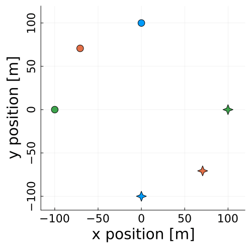
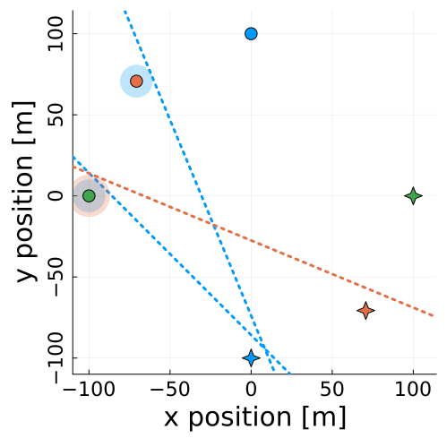
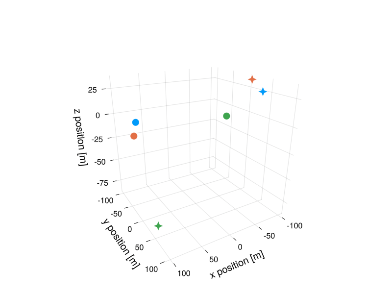
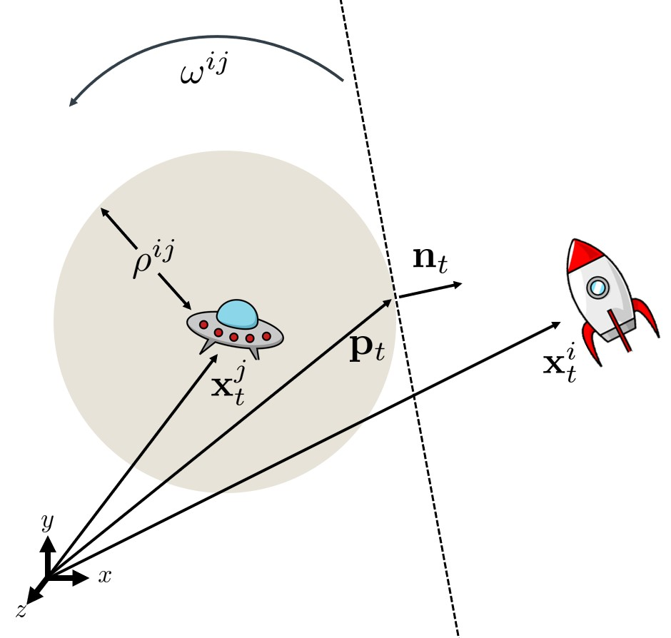

# SlackHyperplanes.jl

Collision-free trajectories for non-cooperative multi-agent systems using inferred rotating hyperplane inequality constraints. 

An example using the Hill-Clohessy-Wiltshire equations for relative orbital motion:
<table>
  <tr>
    <td style="height: 10px;">1. Noisy expert data</td>
    <td style="height: 10px;">2. Inferred hyperplanes</td>
    <td style="height: 10px;">3. Collision-free trajectory</td>
  </tr>
  <tr>
    <td valign="top"></td>
    <td valign="top"></td>
    <td valign="top"></td>
  </tr>
 </table>

> Note: this is a work in progress. For more details on how to use it please reach out to me at [fernandopalafox@utexas.edu](mailto:fernandopalafox@utexa.edu) or open an issue.

## Approach 

We propose a game-theoretic method for collision avoidance based on rotating
hyperplane constraints. It is challenging to select hyperplane parameters (rotation rate, keep-out zone (KoZ) radius, and initial orientation) without introducing infeasibilities into the game. Therefore, we infer the parameters from expert data by solving for the parameters for which the resulting equilibrium trajectories best match the observed data.

There are two steps to our approach:
1. Infer the hyperplanes from the expert trajectories using an inverse game solver.
2. Use the inferred hyperplanes to generate collision-free trajectories for previously unseen scenarios.

### Rotating Hyperplanes

Rotating hyperplanes are essentially half-plane constraints that rotate over time. They are defined by a normal vector $\mathbf{n}$, a rotation rate $\omega$, and a KoZ radius $\rho$. The normal vector is centered at an "obstacle" player $j$ and is rotated by $\omega$ at each time step, and the hyperplane is defined by the normal vector and the KoZ radius. An ego robot $i$ avoids collisions with $j$ by staying on the same side of the hyperplane as $j$.

### 1. Inverse Game Solver
Using collision-free expert data, we infer hyperplane parameters $\theta$ by minimizing the difference between the observed trajectories, and the equilibrium trajectory from a game parameterized by $\theta$.

To avoid dealing with inequality constraints (they introduce a mixed-integer problem in the inverse game), we replace the inequality constraints with slack variables.

`experiments/noise.jl` contains the code for running the inverse game solver on expert trajectories with noise. 

### 2. Collision-free Trajectories
Once we have a set of hyperplane parameters, we can use them to generate collision-free trajectories for previously unseen initial conditions. We do this by solving for the KKT conditions of a game parameterized by $\theta$.

`experiments/montecarlo_nsat_3d.jl` contains the code for running  a Monte Carlo analysis of the whole pipeline: load expert data -> infer hyperplanes -> generate trajectories.

## Setup

After you have cloned the repository, you can install all dependencies at the
versions recorded in the `Manifest.toml`:

1. Navigate to the installation directory, e.g. `cd ~/.julia/dev/PartiallyObservedInverseGames` **edit this**
2. Start Julia in project mode: `julia --project`
3. Hit `]` to enter package mode and run: `pkg> instantiate`

## Directory Layout

- `src/` contains the implementations of our method and the baseline for
  inverse planning. Beyond that it contains implementations of forward game
  solvers and visualization utilities.

- `experiments/` contains the code for reproducing the Monte Carlo studies.

## Issues

- Replacing the inequality constraints with slack variables is not ideal since it is hard to keep the slacks positive when solving the forward game. Therefore, I've archived this approach in favor of framing the inverse game as a differentiable mixed-complementarity program, and using a gradient-based method to solve for the hyperplane parameters.

## Acknowledgements

Built from a fork of [PartiallyObservedInverseGames](https://github.com/PRBonn/PartiallyObservedInverseGames.jl)